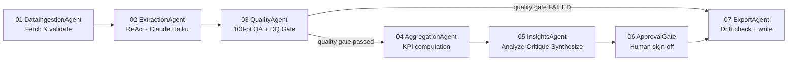

# Cost-to-Serve Architect

**A production AI system that discloses what it doesn't know yet.**

*AI Architecture Case Study — Telecom Call Intelligence — September 2026*

A 7-node LangGraph pipeline that extracts 70+ structured fields per customer-care call, built with the governance, cost control, and honest self-assessment a system needs before it can be trusted with production spend — not just a demo.

| | | | |
|---|---|---|---|
| **$319.5K/mo** modeled savings | **98.6/100** avg. extraction QA | **87.6%** golden-set eval accuracy (real run) | **7** specialized agents, one graph |

---

## 01 · The Business Problem

Telecom care centers can't see which calls are actually worth having. A carrier handling 100,000 monthly care calls at an industry-typical $6/call fully-loaded cost has no systematic way to separate value-creating calls from pure overhead — unless every call is read the same way, at the same depth, every time. That's the problem this pipeline solves: it extracts 70+ structured fields per call (issue category, resolution method, sentiment trajectory, phase-level time allocation, upsell outcome) so cost, quality, and automation-fit questions can be answered from data instead of sampling a handful of calls a month.

| Metric | Value |
|---|---|
| Monthly cost baseline | $600K · 100K calls · $6/call |
| Avoidable contacts | 59.3% |
| Escalation rate vs. 15% industry average | 23.3% |
| Fully AI-resolvable | 44.2% |

Figures traced to a 172-call verified analysis run (`outputs/full_results_combined_*.json`), not projected from a handful of calls.

## 02 · Opportunity Assessment

Five findings, each independently actionable:

1. **Nearly six-in-ten calls should never happen.** 59.3% avoidable — billing confusion, preventable technical issues, self-serve-answerable questions.
2. **Four-in-ten calls need no human agent.** 44.2% fully AI-resolvable: plan queries, roaming activation, billing credits — deterministic operations.
3. **Escalation runs 55% above industry.** 23.3% vs. 15% benchmark; each escalation costs 3–5× a standard call.
4. **Upsell converts at 92% when attempted, but agents only try 35% of the time.** A behavioral lever, not a demand-side one.
5. **A quarter of demand is preventable before the phone rings.** 25.0% of contacts carry a detectable proactive trigger — bill spikes, usage thresholds, travel signals.

## 03 · Cost-Benefit

$600K to $280.5K a month, without adding headcount. Three levers, each gated by a realistic capture rate rather than 100% adoption on day one:

```
Monthly cost model · 100K calls · $6/call
─────────────────────────────────────────────────────────
Baseline cost today                                $600,000
Proactive prevention   · 25.0% of calls · 60% capture  −$90,000
Self-serve automation  · 43.6% of calls · 85% capture −$222,360
Agentic AI resolution  ·  1.7% of calls · 70% capture   −$7,140
─────────────────────────────────────────────────────────
Target state                                       $280,500
53% cost reduction · $319,500/month saved
```

| Cost bucket | Share of agent time | Monthly cost |
|---|---|---|
| Cost to Serve (P1–P4) | 85.7% | $514,200 |
| Cost to Sell (P5) | 5.7% | $34,200 |
| Cost to Retain (cross-cutting) | 8.6% | $51,600 |

## 04 · Technical Architecture

Agents are stateless — `run(state: dict) -> dict` — and state handoff is immutable: every agent returns `{**state, "new_key": new_value}`. Nothing mutates in place, so any two agents' outputs can be diffed against the same input.



### 01 · DataIngestionAgent — Fetch & validate

Streams call transcripts from the source dataset (HuggingFace corpus with local-CSV fallback). Validates minimum transcript length and turn count before anything downstream sees the call.

Handoff: `validated_transcripts` + `validation_errors` into shared state.

### 02 · ExtractionAgent — Claude Haiku 4.5 · ReAct

This is the pipeline's clearest thinking→reasoning→acting loop:

| Step | Action |
|---|---|
| **REASON** | Assess which of 7 critical fields are likely present before calling the model. |
| **ACT** | Call Claude Haiku 4.5 for full 70-field structured extraction, JSON mode. |
| **OBSERVE** | Score field coverage inline against the critical-field list. |
| **REASON** | Coverage below threshold? Decide whether a targeted gap-fill retry is warranted. |
| **ACT** | Re-query for only the missing fields, not the whole record. |
| **OBSERVE** | Merge and record the coverage improvement. |

A second pass fires only when the first one measurably needs it — not on every call. Rate-limited per provider (Claude: 50 RPM); every LLM client is constructed with an explicit timeout and `max_retries=1`, not the SDK default, because SDK-level retry compounding with application-level retry once nearly hit the orchestrator's 600-second subprocess timeout.

### 03 · QualityAgent — 100-pt QA + Data Quality Gate

**QA Score (0–100):** four weighted dimensions — completeness (30), enum validity (25), cross-field consistency (25), plausibility (20). Grades HIGH (≥85) / MEDIUM (≥60) / LOW; LOW is excluded from aggregation.

**Data Quality Gate (pass/fail, independent):** can this call's *time data* be trusted for cost-lever attribution? Three deterministic, non-LLM checks — phase-reconciliation, timestamp ground-truth against the source dataset's own turn timestamps, and transcript-completeness. A call can score 100/100 on QA and still fail this gate; the two are never blended into one number, because a well-formed extraction is not the same claim as trustworthy time data.

> **Routing:** a catastrophic pass-rate failure here routes directly to ExportAgent (node 07), skipping aggregation, insights, and approval entirely — the pipeline never silently proceeds on data it can't stand behind.

### 04 · AggregationAgent — KPI computation

Rolls per-call extractions into executive KPIs (FCR, AHT, avoidable-call rate, agentic-AI-resolvable rate) and the three-lever cost-to-serve model (proactive / self-serve / agentic), each allocated in direct proportion to phase-duration fields — which is exactly why the Data Quality Gate upstream matters: a call whose phase durations don't reconcile misattributes cost across every downstream dollar figure.

### 05 · InsightsAgent — NVIDIA NIM · deliberation

| Pass | Action |
|---|---|
| **ANALYZE** | Chain-of-thought pass over aggregated KPIs — which are outside benchmark, likely root cause. |
| **CRITIQUE** | A second pass grades the first pass's own recommendations for specificity and data-grounding — self-reflection, not a rubber stamp. |
| **SYNTHESIZE** | A third pass rewrites anything the critique flagged as weak before it reaches an executive audience. |

Provider chain: NVIDIA NIM (Llama 3.3 70B) → Claude Haiku → rule-based fallback, selected automatically on key availability and live circuit-breaker state. A provider outage trips a shared circuit breaker once and stays tripped for the rest of the run — remaining passes skip straight to the next tier instead of re-paying the same timeout repeatedly.

### 06 · ApprovalGate — Human-in-the-loop

Optional checkpoint before export: presents the KPI summary and waits for explicit operator confirmation, with a configurable auto-approve timeout for unattended batch runs. Disabled by default in this configuration — a transparent pass-through that costs nothing in CI, but the seam exists for a deployment that wants a human in the loop before every export.

### 07 · ExportAgent — Write + drift check

Writes CSV, full JSON, QA report, insights, decision log, audit trail, and the dashboard's `summary.json`. Immediately before recording the run into history, it runs the drift check against the rolling baseline of prior runs — deliberately positioned so the baseline can never include the run being compared against itself. The drift-check call itself is wrapped in a try/except: an exception there is caught and logged, never allowed to fail the export, matching the same never-block-export pattern used for the vector-memory write.

## 05 · Quality, Drift, Evals, Observability

Four separate questions, four separate answers — never blended into one score, because extraction can be well-formed and still untrustworthy for cost attribution, and a run can look fine and still be quietly drifting.

| Mechanism | Status | What it answers |
|---|---|---|
| QA Score | Live | Is the extraction well-formed? (Live average: 98.6/100) |
| Data Quality Gate | Live | Can this call's time data be trusted for cost attribution? |
| Drift Detection | New this release | Has a run's KPIs moved beyond both a statistical (2σ) and a practical (10%) bound vs. the rolling baseline? |
| Golden-Set Eval | New this release | Has extraction quality regressed against 15 frozen, verified-HIGH calls? |
| Decision Log | Live | What did each agent decide, and why? (never transcript text or PII) |
| Langfuse / LangSmith | Live | Full LLM observability, one trace per call/run, transcript content redacted before export |

### Golden-Set Eval — actual result, run 2026-09-25

| Calls scored | Aggregate accuracy | Verdict | Actual spend |
|---|---|---|---|
| 15/15, 0 failures | 87.6% | **PASS** (threshold 85%) | $0.11, as estimated |

## 06 · Security & Cost Control

The failure mode this system is designed against isn't a wrong answer — it's an unattended one.

- **Multi-layer sanitization** — InputSanitizer (prompt injection, PII), OutputSanitizer (code execution, secrets, response-size bombs), AgentScopeGuard (per-agent tool access), SecretGuard.
- **Budget & rate governance** — hard per-run spend ceiling; per-provider rate limiters; every LLM client built with an explicit timeout and `max_retries=1`.
- **Strict halt-on-failure** — the orchestrator halts an entire multi-batch run on the first task failure and requires explicit human acknowledgement to resume. This replaced an auto-retry loop that silently doubled spend on a hung batch in production.
- **Circuit breakers** — a provider outage (Gemini quota, NVIDIA timeout) trips once and stays tripped for the rest of the run; remaining calls skip straight to a fallback instead of re-paying the same timeout repeatedly.

## 07 · Known Issues

What's still imperfect, stated before anyone has to ask.

**Drift detection is near-inert on FCR at current batch granularity** *(documented)*
Against 28 real historical runs, FCR's rolling baseline standard deviation is wide enough (20-call batches produce high binomial noise) that the drift check would only fire outside roughly a 24–114% band — effectively never, for a percentage metric. The threshold design itself is sound; the sensitivity at this data granularity was undersold until this audit quantified it. Mitigated: a minimum-call-count filter now excludes low-volume runs from both the baseline and the current-run comparison. Full fix: run drift on the ~100-call orchestrated run, not the 20-call batch.

**The eval harness scores first-pass extraction only** *(documented)*
Golden-set ground truth was captured from the full pipeline, including the ReAct gap-fill pass; the eval re-extracts via first-pass only. A case that originally needed gap-fill to reach its correct values can show a false regression. Accepted for now, documented in the harness itself; wiring in gap-fill is a larger, separately-scoped change.

**An auto-retry loop once cost real money in production** *(resolved)*
A prior version silently retried a hung batch twice before a human noticed — roughly $1.80 wasted on discarded work. Root cause: no policy distinguishing "call failed, retry the call" from "batch is stuck, stop and ask." Fixed: the orchestrator now halts the entire run on first failure; no config flag re-enables auto-retry without a discussion first.

## 08 · Outcome & Value

The system, and the judgment behind it, are the same deliverable. $319.5K/month in modeled savings only means something if the extraction underneath it can be trusted — and trust here comes from measurement, not confidence.

**Looking for someone who ships AI systems, not AI demos.** This pipeline — architecture, governance, drift monitoring, and the honest gaps above — is one example of how AI strategy and platform ownership get executed end to end. Open to a conversation about your team's automation roadmap: [linkedin.com/in/vinothnataraj](https://www.linkedin.com/in/vinothnataraj)

---

*See also: [`ARCHITECTURE.md`](../ARCHITECTURE.md) for full technical reference, [`docs/engineering-standards.md`](engineering-standards.md) for testing/CI/dependency practices, and the interactive version of this case study (linked from the portfolio site).*
